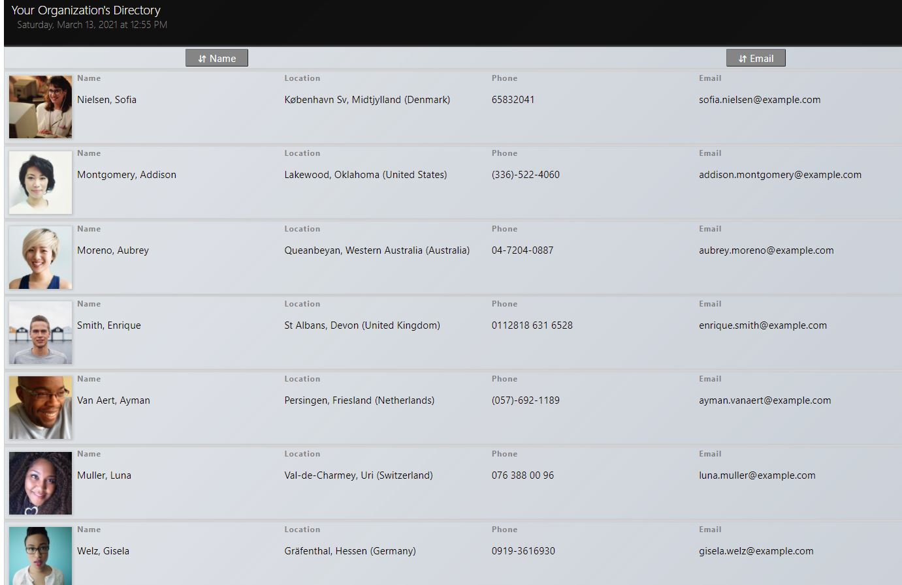

# React Employee Directory
[](/LICENSE)
 


<i> Demonstrating how React and REST APIs can be leveraged to implement a simple and useful single page web application.
</i>   <br>


   <br>

## Table of Contents

- [Overview](#overview)
- [Getting Started](#getting_started)
- [Usage](#usage)
- [Installation](#installation)
- [Deployment](#deployment)
- [Built Using](#tech_stack)
- [Contributing](#contributing)

---
##  Overview <a name = "overview"></a>

React Employee Directory is a simple dynamic, single page web application which demonstrates how React can be used wit REST APIs to make an inuitve and user-friendly web utility. The combination of React's dynamic html rendering, and the data delivery functions provided by REST APIs make this approach an efficent way to implement this type of solution.

----
##  Getting Started <a name = "getting_started"></a>


In order to use develop this application on your desktop machine, you will need to install Node.JS and Git. Clone this project to any location on your file system using the following in your development terminal:

```
git clone https://github.com/alane019/react-employee-directory.git
```
This will copy all files from this github repository to your working directory.

----
## Installation  <a name = "installation"></a>

 Install all node package dependencies listed in the package.json file using the following command in your terminal, in the directory of the project:

```
npm install
```
You can also use:

```
npm i
```


----

##  Usage <a name = "usage"></a>


When using React Employee Directory, random user data is pulled using a random user API provider (https://randomuser.me), which sends a list of randomly generated user data. This user data is used to represent employees in this and provide a working demonstration of the user interface, populated with example people. You can sort employees included in the directory listing by using the sort control. 

----
##  Deployment <a name = "deployment"></a>
[Create React App](https://create-react-app.dev/docs/getting-started) was used to stand up this demo. You can follow the steps provided in the [official documentation](https://create-react-app.dev/docs/getting-started) throughout the development process to test and deploy.

 To launch a test version of the application, use the following in your development terminal: 

 `npm start`  or  `yarn start`.

 To prepare a production bundle for deployment, use `npm run build` or `yarn build`.

----

##  Technologies Used  <a name = "tech_stack"></a>
- [NodeJs](https://nodejs.org/) -  JavaScript runtime. 
- [React](https://reactjs.org/) - JavaScript front-end library.
- [Axios](https://github.com/axios/axios) - Promise based HTTP client optimized for effificent development of secure and performant NodeJS web applications. 
- [Create React App](https://create-react-app.dev/docs/getting-started) is used to bootstrap the setup and configuration of build tools like [Babel](https://babeljs.io/) and [Webpack](https://webpack.js.org/), which are used for JavaScript module bundling and dynamic transpiling of project resources.


----
##  Contributing <a name = "contributing"></a>

Any and all contributions are welcome. Submit a pull request or an issue if you would like to contribute code changes, or request improvements. This project should be a great resource for anyone looking for a working introduction to NodeJs React development with REST APIs. 


